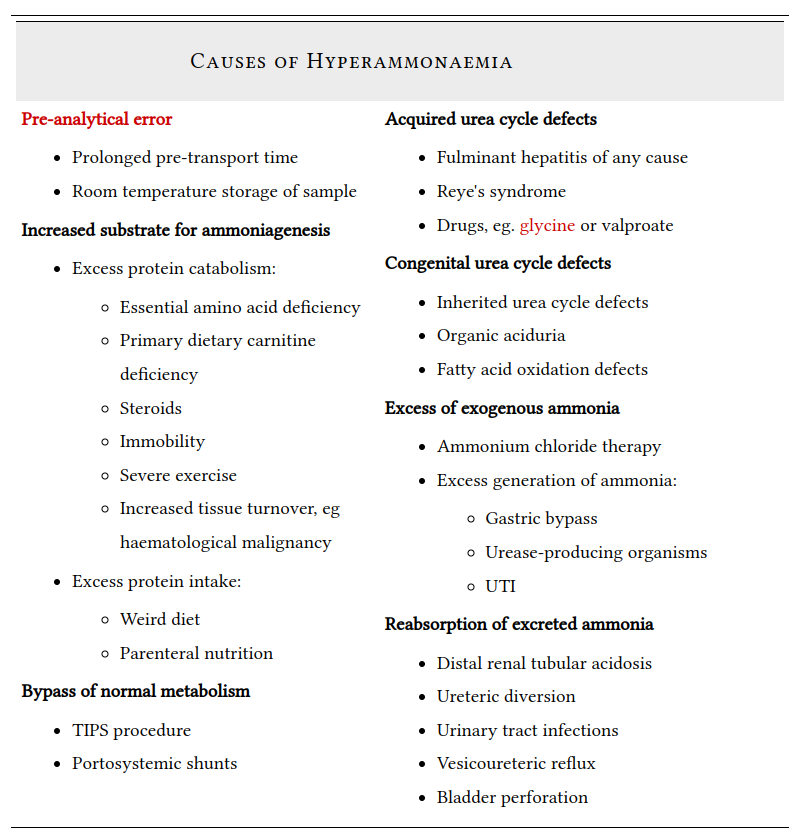

type:: blood_test

- this refers to ammonia as a blood test in a clinical setting
- measurement of ammonia
	- blood sample has to be put on ice and processed as fast as possible
	- if the blood sample is not on ice or left to stand for any period of time, the ammonia concentration will increase
	- sample processing is a frequent source of error in the interpretation of ammonia blood levels
		- levels will be falsely increased #measurement_error
- # causes of hyperammonemia
	- 
-
- # indications
	- [[laboratory assessment of liver function]] #liver_disease
	- unexplained #encephalopathy
	-
- # links
	- https://derangedphysiology.com/main/cicm-primary-exam/required-reading/liver-physiology/Chapter%20313/ammonia
	-