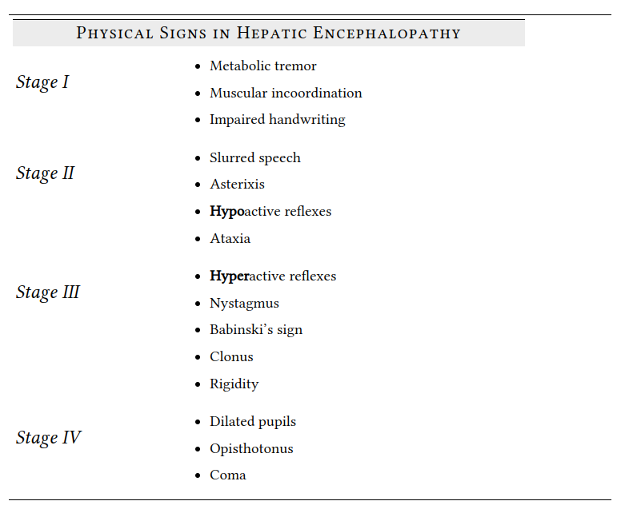

type:: disease

- # definition
	- a spectrum of neuropsychiatric abnormalities seen in patients with liver dysfunction after exclusion of other known brain disease
- # clinical
	- asterixis
	- dysarthria
	- disordered sleep-wake cycle
	- delirium
	- decreased level of consciousness
	- long white matter tract signs
	- associated liver disease
		- severe liver disease
		- the presence of a triggering factor
		- previous hx of similar episodes
- # classification
	- 4 stages
	- 
-
- # diagnosis
	- can't be confirmed
		- is a diagnosis of exclusion
	-