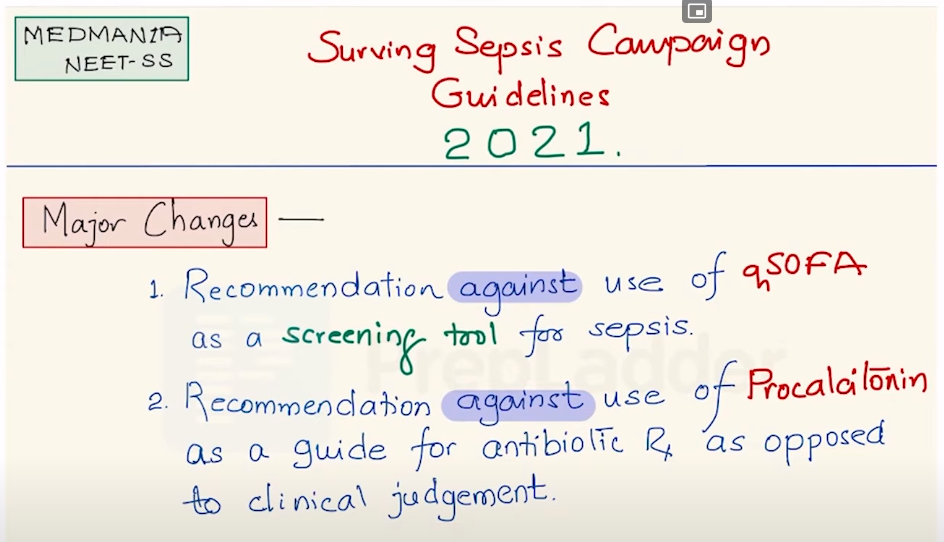
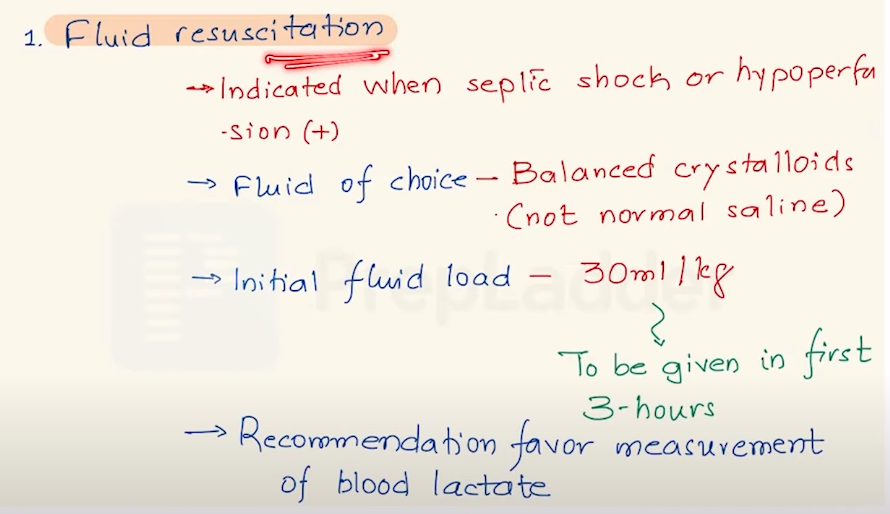

-
- ## major chages from previous guildelines
	- 
		- https://www.youtube.com/watch?v=GnF28WfapbU
	- #against_recommendation do not use #qsofa as a #screeening_tool for #sepsis
	- #against_recommendation do not use #procalcitonin as a guide for #ATB_Rx as opposed to clinical judgment
- ## fluid resuscitation
	- 
		- https://www.youtube.com/watch?v=GnF28WfapbU
	- fluid of choice is balanced crystalloids
	- initial fluid load 30 ml per kg
		- to be given in the first 3 hours
	- #for_recommendation measure #lactate_blood
	-
- # links
	- https://www.sccm.org/Clinical-Resources/Guidelines/Guidelines/Surviving-Sepsis-Guidelines-2021
	-